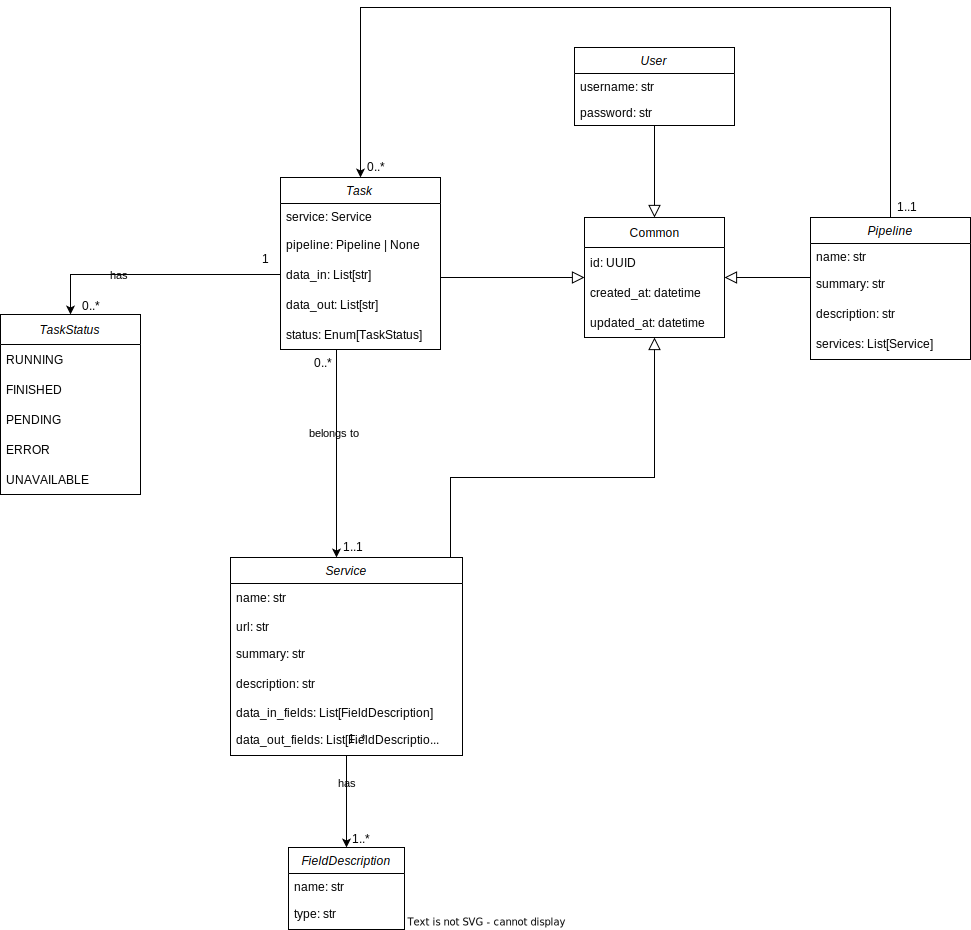
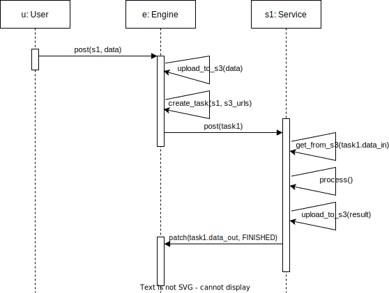

# Engine

- [Code](../../engine)
- Engine URL when run locally: <http://localhost:8080/docs>
- Engine URL when deployed on Fribourg's Kubernetes: <https://engine-csia-pme.kube.isc.heia-fr.ch/docs>
- MinIO Console URL when deployed on Fribourg's Kubernetes: <https://console-minio-csia-pme.kube.isc.heia-fr.ch>

## Description

This service allows to create and manage pipelines of microservices. This service was built and tested with python 3.9, therefore we recommend to use the docker version instead of running it natively.

### Running

You can start the Engine with the following commands.

```bash
# Start the infrastructure from the `engine` directory
docker compose up

# Start the app from the `src` directory
uvicorn --reload main:app
```

### Testing

For each module a test file is available to check the correct behavior of the code. The tests are run using the `pytest` library with code coverage check. To run the tests, use the following command inside the `engine` folder:

```bash
pytest --cov-report term:skip-covered --cov-report term-missing --cov=. -s --cov-config=.coveragerc
```

### SQLModel

This part of the code has been built by following the [SQLModel tutorial](https://sqlmodel.tiangolo.com/tutorial/) and using DDD (Domain Driven Design) to keep a clean and simple code.

The models defined for each classes is represented as follows:



A normal sequence of events when launching a request to a service is represented as follows:



The API documentation is automatically generated by FastAPI using the OpenAPI standard. A user friendly interface provided by Swagger is available under the `/docs` route, where the endpoints of the services are described.

## Pipelines

The `pipelines` folder contains several examples of ready to use pipelines:

- `blur-women.json`: Blur women detected in an image.
- `convertjpg.json`: Convert any image to jpg.
- `face-thumbs.json`: Generate a thumbnail of each face detected in the image.
- `faceblur.json`: Blur every face detected in an image.
- `people-description.json`: Analyzes every face in an image and returns a global description.
