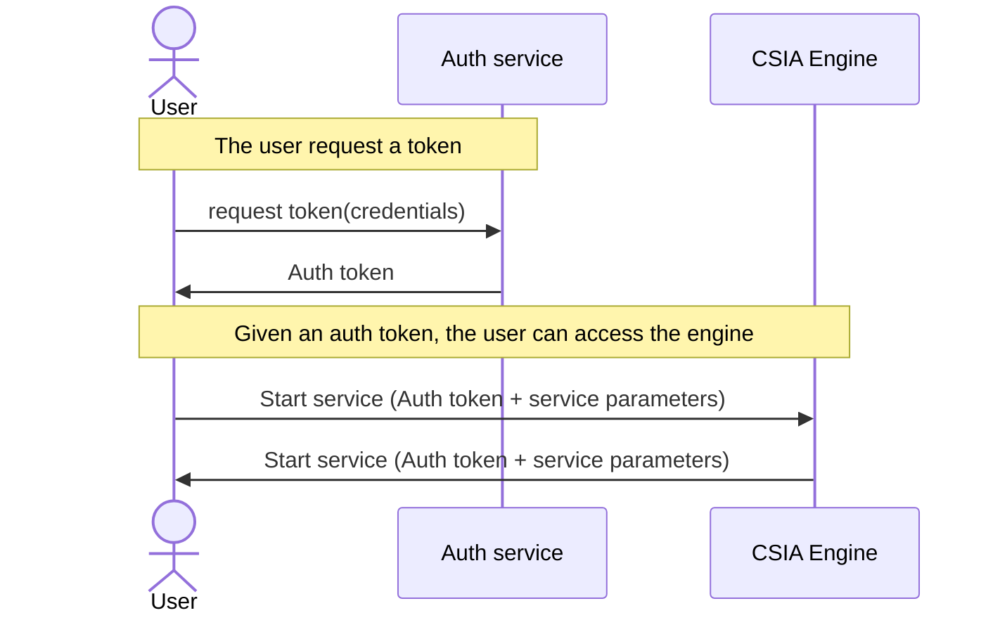

# Authorization and authentication

Authorization and authentication have been designed, but not implemented.

The [engine](./engine.md) is responsible for the authorization and authentication.

## Service authorization
Each service stores an authorization key. The engine will provide this secret to
prove it is authorized to use the service.

## User authentication
Authentication will be delegated to a [OpenID](https://en.wikipedia.org/wiki/OpenID) compliant service, for instance
[SWITCH edu-ID](https://www.switch.ch/edu-id/), [keycloak](https://www.keycloak.org/), ...

## Authorization
A matrix of groups of users and a matrix of groups and authorizations will be used
to store the permissions.

## Identified key points
* When the engine is first started, an *admin* user must be created
* Service registration must be authorized. For instance an authorized user asks for a token that will be used to auhorize the service registration.
