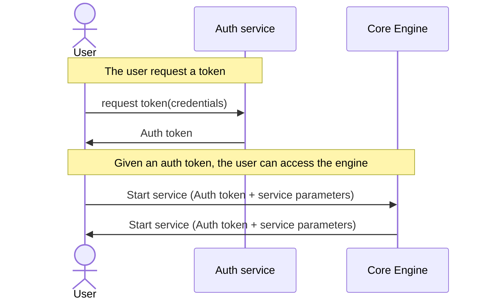

# Authorization and authentication

Authorization and authentication have been designed, but not implemented.

The [core-engine](./core-engine.md) is responsible for the authorization and authentication.

## Service authorization

Services may require a token to authenticate the core-engine. The core-engine will store the authentication token in it's database.
If the service is secured by `https`, the token may be directly stored in the service's `URL`. In any case, if the service isn't using `https`, the _secret_ token may not be _secret_.

## User authentication

Authentication will be delegated to a [OpenID](https://en.wikipedia.org/wiki/OpenID) compliant service, for instance
[SWITCH edu-ID](https://www.switch.ch/edu-id/), [keycloak](https://www.keycloak.org/), ...

## Authorization

A matrix of groups of users and a matrix of groups and authorizations will be used
to store the permissions, for each service.

## Identified key points

* When the core-engine is first started, an _admin_ user must be created
* Service registration must be authorized. For instance an authorized user asks for a token that will be used to authorize the service registration.
