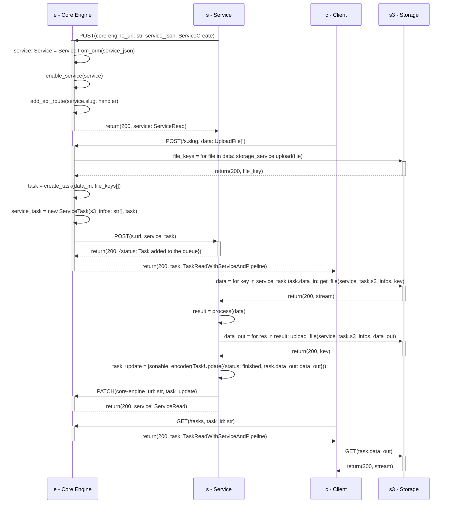

# Core Engine

The Core Engine allows to create and manage pipelines of microservices.

It is built using Python 3.10, FastAPI, SQLModel and Domain-driven design.

The API documentation is automatically generated by FastAPI using the OpenAPI standard. A user-friendly interface provided by Swagger is available under the `/docs` route, where the endpoints of the services are described.

## UML diagram

The models defined for each class is represented as follows:


## Interaction user <-> core-engine <-> service

A normal sequence of events when launching a request to a service is represented as follows:



## Environment variables

All environment variables are described in the [`.env`](https://github.com/swiss-ai-center/core-engine/blob/main/core-engine/.env) file.

The environment variables can be overwritten during the CI/CD pipeline described in the [`core-engine.yml`](https://github.com/swiss-ai-center/core-engine/blob/main/.github/workflows/engine.yml) GitHub workflow file.

## Start the service locally with Python

In the `core-engine` directory, start the Core Engine with the following commands.

```sh
# Generate the virtual environment
python3 -m venv .venv

# Activate the virtual environment
source .venv/bin/activate

# Install the requirements
pip install \
    --requirement requirements.txt \
    --requirement requirements-all.txt
```

Start the dependencies.

``` sh
docker compose up
```

Start the application.

```sh
# Switch to the `src` directory
cd src

# Start the application
uvicorn --reload --port 8080 main:app
```

Access the Core Engine documentation on <http://localhost:8080/docs>.

## Run the tests with Python

For each module a test file is available to check the correct behavior of the code. The tests are run using the `pytest` library with code coverage check. To run the tests, use the following command inside the `src` folder:

```sh
pytest --cov-report term:skip-covered --cov-report term-missing --cov=. -s --cov-config=.coveragerc
```

## Start the service locally with minikube and the Docker image hosted on GitHub

Start the Core Engine with the following commands. This will start the Core Engine with the official Docker images that are hosted on GitHub.

In the `core-engine` directory, start the Core Engine with the following commands.

```sh
# Start MinIO
kubectl apply \
    -f kubernetes/minio.pvc.yml \
    -f kubernetes/minio.config-map.yml \
    -f kubernetes/minio.stateful.yml \
    -f kubernetes/minio.service.yml

# Start PostgreSQL
kubectl apply \
    -f kubernetes/postgres.pvc.yml \
    -f kubernetes/postgres.config-map.yml \
    -f kubernetes/postgres.stateful.yml \
    -f kubernetes/postgres.service.yml

# Start the core-engine
kubectl apply \
    -f kubernetes/core-engine.config-map.yml \
    -f kubernetes/core-engine.stateful.yml \
    -f kubernetes/core-engine.service.yml
```

Create a tunnel to access the Kubernetes cluster from the local machine. The terminal in which the tunnel is created must stay open.

```sh
# Open a tunnel to the Kubernetes cluster
minikube tunnel --bind-address 127.0.0.1
```

Access the Core Engine documentation on <http://localhost:8080/docs>.

## Start the service locally with minikube and a local Docker image

**Note**: The Core Engine StatefulSet (`core-engine.stateful.yml` file) must be deleted and recreated every time a new Docker image is created.

In the `core-engine` directory, build the Docker image with the following commands.

```sh
# Access the Minikube's Docker environment
eval $(minikube docker-env)

# Build the Docker image
docker build -t ghcr.io/swiss-ai-center/core-engine:latest .

# Exit the Minikube's Docker environment
eval $(minikube docker-env -u)

# Edit the `kubernetes/core-engine.stateful.yml` file to use the local image by uncommented the line `imagePullPolicy`
#
# From
#
#        # imagePullPolicy: Never
#
# To
#
#        imagePullPolicy: Never
```

In the `core-engine` directory, start the Core Engine with the following commands.

```sh
# Start MinIO
kubectl apply \
    -f kubernetes/minio.pvc.yml \
    -f kubernetes/minio.config-map.yml \
    -f kubernetes/minio.stateful.yml \
    -f kubernetes/minio.service.yml

# Start PostgreSQL
kubectl apply \
    -f kubernetes/postgres.pvc.yml \
    -f kubernetes/postgres.config-map.yml \
    -f kubernetes/postgres.stateful.yml \
    -f kubernetes/postgres.service.yml

# Start the core-engine
kubectl apply \
    -f kubernetes/core-engine.config-map.yml \
    -f kubernetes/core-engine.stateful.yml \
    -f kubernetes/core-engine.service.yml
```

Create a tunnel to access the Kubernetes cluster from the local machine. The terminal in which the tunnel is created must stay open.

```sh
# Open a tunnel to the Kubernetes cluster
minikube tunnel --bind-address 127.0.0.1
```

Access the Core Engine documentation on <http://localhost:8080/docs>.
