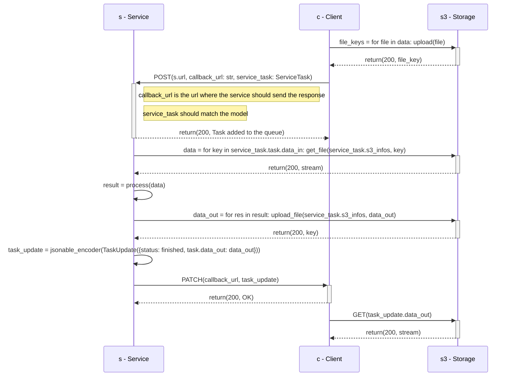

# Reference

## Engine and Webapp

| Service                                           | Code                                                      | URL when run locally with minikube    | URL when deployed on Fribourg's Kubernetes            |
| ------------------------------------------------- | --------------------------------------------------------- | ------------------------------------- | ----------------------------------------------------- |
| [Engine](./engine.md){ style="color: inherit;" }  | <https://github.com/csia-pme/csia-pme/tree/main/engine>   | <http://localhost:8080/docs>          | <https://engine-csia-pme.kube.isc.heia-fr.ch/docs>    |
| [Webapp](./webapp.md){ style="color: inherit;" }  | <https://github.com/csia-pme/csia-pme/tree/main/webapp>   | <http://localhost:8181/docs>          | <https://webapp-csia-pme.kube.isc.heia-fr.ch/docs>    |

## Services

| Service                                                                   | Code                                                                          | URL when run locally with minikube    | URL when deployed on Fribourg's Kubernetes                    |
| ------------------------------------------------------------------------- | ----------------------------------------------------------------------------- | ------------------------------------- | ------------------------------------------------------------- |
| [ae_ano_detection](./ae-ano-detection.md){ style="color: inherit;" }      | <https://github.com/csia-pme/csia-pme/tree/main/services/ae_ano_detection>    | <http://localhost:8282/docs>          | <https://ae-ano-detection-csia-pme.kube.isc.heia-fr.ch/docs>  |
| [average_shade](./average-shade.md){ style="color: inherit;" }            | <https://github.com/csia-pme/csia-pme/tree/main/services/average_shade>       | <http://localhost:8383/docs>          | <https://average-shade-csia-pme.kube.isc.heia-fr.ch/docs>     |
| [digit_recognition](./digit-recognition.md){ style="color: inherit;" }    | <https://github.com/csia-pme/csia-pme/tree/main/services/digit_recognition>   | <http://localhost:8484/docs>          | <https://digit-recognition-csia-pme.kube.isc.heia-fr.ch/docs> |
| [face_analyzer](./face-analyzer.md){ style="color: inherit;" }            | <https://github.com/csia-pme/csia-pme/tree/main/services/face_analyzer>       | <http://localhost:8585/docs>          | <https://face-analyzer-csia-pme.kube.isc.heia-fr.ch/docs>     |
| [face_detection](./face-detection.md){ style="color: inherit;" }          | <https://github.com/csia-pme/csia-pme/tree/main/services/face_detection>      | <http://localhost:8686/docs>          | <https://face-detection-csia-pme.kube.isc.heia-fr.ch/docs>    |

This sequence diagram illustrates the interaction between an user and the service, without using the Engine.

