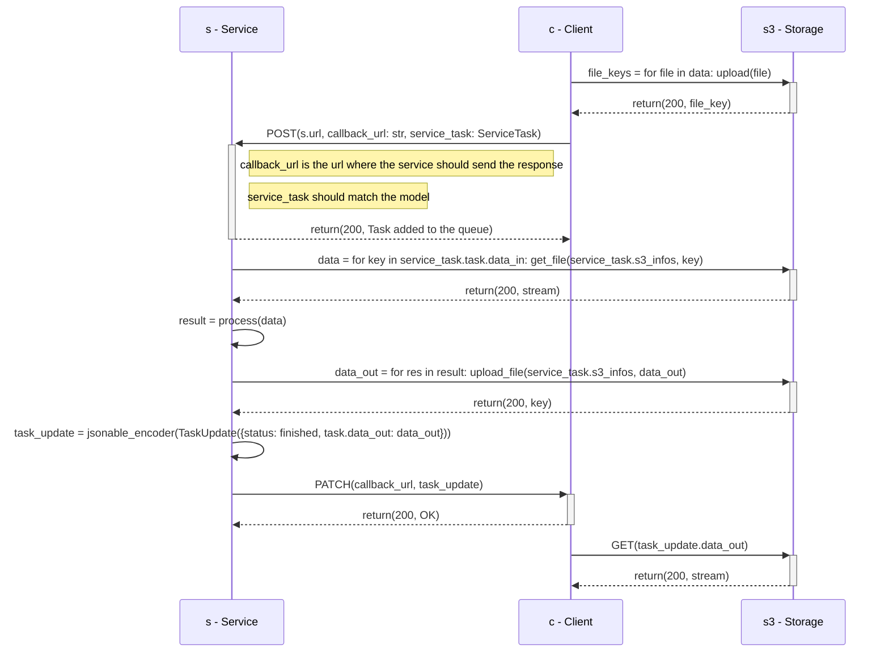

# Pipeline

This page describes the pipeline architecture and its specifications.

The Pipeline is a group of services that are chained together. It is defined by a JSON file that describes the services and their order and is available through a REST API that can be used to process data.
It does not rely on a Pod or a Docker image since it is a group of services. It is only stored in the database.

## Architecture

To see the general architecture of the project, see the global [UML Diagram](/csia-pme/reference/engine/#uml-diagram).

This sequence diagram illustrates the interaction between an user and the pipeline.



## Specifications

Any service can be part of a pipeline. It must be registered to the engine.

### Endpoints

A pipeline will be registered on the Engine URL with its slug. For example, if the pipeline slug is `my-pipeline`, the endpoints will be:

- `POST /my-pipeline`: Add a task to the pipeline


### Models

#### Task Input

The `POST /compute` endpoint must be able to receive a JSON body that matches the following model:

```python
class ServiceTaskTask(BaseModel):
    """
    Task update model
    This model is used to update a task
    """
    id: UUID
    data_in: List[str]
    service_id: UUID
    pipeline_id: UUID | None


class ServiceTaskBase(BaseModel):
    """
    Base class for Service task
    This model is used in subclasses
    """
    s3_access_key_id: str
    s3_secret_access_key: str
    s3_region: str
    s3_host: str
    s3_bucket: str
    task: ServiceTaskTask
    callback_url: str
```

The `data_in` and `data_out` fields are lists of S3 object keys. The `status` field is a string that can be one of the following values:

```python
class TaskStatus(str, Enum):
    PENDING = "pending"
    FETCHING = "fetching"
    PROCESSING = "processing"
    SAVING = "saving"
    FINISHED = "finished"
    ERROR = "error"
    SCHEDULED = "scheduled"
    SKIPPED = "skipped"
    UNAVAILABLE = "unavailable"
```

The S3 settings are used to connect to the S3 storage where the data is stored and where the result will be stored. The `callback_url` is the url where the service should send the response.

A JSON representation would look like this:
```json
{
  "s3_access_key_id": "access_key",
  "s3_secret_access_key": "secret_key",
  "s3_region": "eu-west-3",
  "s3_host": "test.s3.com",
  "s3_bucket": "test-bucket",
  "task": {
    "data_in": [
      "key1-in.png",
      "key2-in.json"
    ],
    "service_id": "3fa85f64-5717-4562-b3fc-2c963f66afa6",
    "pipeline_id": "45a85f64-5717-4562-b3fc-34a6f66afa6",
    "id": "76ba4e6a-3b8a-4bda-8407-6eaf5a8e1100"
  },
  "callback_url": "http://my-url.com/callback"
}
```

#### Task Output

Once the task is computed, the service must PATCH the task on `/tasks/{task_id}` with the following model:

```python
class TaskUpdate(BaseModel):
    """
    Task update model
    This model is used to update a task
    """
    service: str | None
    url: str | None
    data_out: List[str] | None
    status: TaskStatus | None
```

The `data_out` field is a list of S3 object keys. The `status` field is a string that can be one of the following values:

```python
class TaskStatus(str, Enum):
    PENDING = "pending"
    FETCHING = "fetching"
    PROCESSING = "processing"
    SAVING = "saving"
    FINISHED = "finished"
    ERROR = "error"
```

A JSON representation would look like this:

```json
{
  "service": "service-name",
  "url": "http://service-url",
  "data_out": [
    "key1-out.png",
  ],
  "status": "finished"
}
```

### Register to the Engine

To register the service to the Engine, the service must send a POST request to the Engine `/services` endpoint with the following model:

```python
class ServiceStatus(Enum):
    AVAILABLE = "available"
    UNAVAILABLE = "unavailable"


class ServiceBase(CoreModel):
    """
    Base class for Service
    This model is used in subclasses
    """
    name: str = Field(nullable=False)
    slug: str = Field(nullable=False, unique=True)
    url: str = Field(nullable=False)
    summary: str = Field(nullable=False)
    description: str | None = Field(default=None, nullable=True)
    status: ServiceStatus = Field(default=ServiceStatus.AVAILABLE, nullable=False)
    data_in_fields: List[FieldDescription] | None = Field(sa_column=Column(JSON), default=None, nullable=True)
    data_out_fields: List[FieldDescription] | None = Field(sa_column=Column(JSON), default=None, nullable=True)

    @validator("slug")
    def slug_format(cls, v):
        if not re.match(r"[a-z\-]+", v):
            raise ValueError("Slug must be in kebab-case format. Example: my-service")
        return v

    # Needed for Column(JSON) to work
    class Config:
        arbitrary_types_allowed = True
```

The `data_in_fields` and `data_out_fields` fields are lists of `FieldDescription` models. A `FieldDescription` model is defined as follows:

```python
class FieldDescriptionType(str, Enum):
    IMAGE_JPEG = "image/jpeg"
    IMAGE_PNG = "image/png"
    TEXT_PLAIN = "text/plain"
    TEXT_CSV = "text/csv"
    APPLICATION_JSON = "application/json"


class FieldDescription(TypedDict):
    """
    Field description
    """
    name: str
    type: List[FieldDescriptionType]
```

The `url` field is the url of the service.

A JSON representation would look like this:

```json
{
  "name": "service-name",
  "slug": "service-slug",
  "url": "http://service-url",
  "summary": "service-summary",
  "description": "service-description",
  "status": "available",
  "data_in_fields": [
    {
      "name": "image",
      "type": [
        "image/jpeg",
        "image/png"
      ]
    },
    {
      "name": "text",
      "type": [
        "text/plain"
      ]
    }
  ],
  "data_out_fields": [
    {
      "name": "image",
      "type": [
        "image/jpeg",
        "image/png"
      ]
    }
  ]
}
```

After the service is registered, it will be available to the Engine's `/service-slug` endpoint.