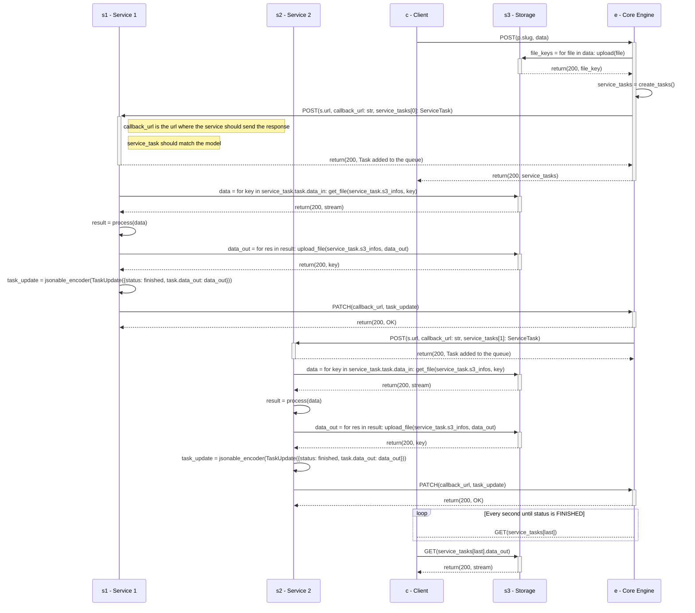
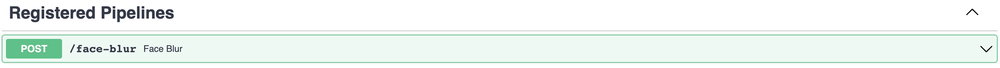

# Pipeline

This page describes the pipeline architecture and its specifications.

The Pipeline is a group of services that are chained together. It is defined by a JSON file that describes the services and their order and is available through a REST API that can be used to process data.
It does not rely on a Pod or a Docker image since it is a group of services. It is only stored in the database.

## Architecture

To see the general architecture of the project, see the global [UML Diagram](../reference/core-engine.md#uml-diagram).

This sequence diagram illustrates the interaction between an user and a pipeline.



## Specifications

Any service can be part of a pipeline. It must be registered to the Core Engine.

### Endpoints

A pipeline will be registered on the Core Engine URL with its slug. For example, if the pipeline slug is `my-pipeline`, the endpoints will be:

- `POST /my-pipeline`: Add a task to the pipeline



### Models

The different models used in the pipeline are described below.

#### Pipeline model

This is the model of a pipeline:

```python
class ExecutionUnitBase(CoreModel):
    """
    ExecutionUnit model
    """
    name: str = Field(nullable=False)
    slug: str = Field(nullable=False, unique=True)
    summary: str = Field(nullable=False)
    description: str | None = Field(default=None, nullable=True)
    status: ExecutionUnitStatus = Field(default=ExecutionUnitStatus.AVAILABLE, nullable=False)
    data_in_fields: List[FieldDescription] | None = Field(sa_column=Column(JSON), default=None, nullable=True)
    data_out_fields: List[FieldDescription] | None = Field(sa_column=Column(JSON), default=None, nullable=True)
    tags: List[ExecutionUnitTag] | None = Field(sa_column=Column(JSON), default=None, nullable=True)

    # Needed for Column(JSON) to work
    class Config:
        arbitrary_types_allowed = True

class ExecutionUnitStatus(Enum):
    AVAILABLE = "available"
    UNAVAILABLE = "unavailable"
    DISABLED = "disabled"


class PipelineBase(ExecutionUnitBase):
    """
    Base class for a Pipeline
    This model is used in subclasses
    """
    pass
```

#### Pipeline Step model

Each pipeline is composed of steps. A step is a service that is part of the pipeline. It is defined by the following model:

```python
class PipelineStepBase(CoreModel):
    """
    Base class for a step in a Pipeline
    This model is used in subclasses
    """
    identifier: str = Field(nullable=False)
    needs: List[str] | None = Field(sa_column=Column(JSON), default=None, nullable=True)
    condition: str | None = Field(default=None, nullable=True)
    inputs: List[str] = Field(sa_column=Column(JSON), nullable=False)

    @validator("identifier")
    def identifier_format(cls, v):
        if not re.match(r"[a-z\-]+", v):
            raise ValueError("Identifier must be in kebab-case format. Example: my-pipeline-step-identifier")
        return v

    class Config:
        arbitrary_types_allowed = True
```

A pipeline step is linked to a service and can have a condition. The condition is a python expression that will be evaluated to know if the step should be executed or not. The condition can use the `needs` field to access the outputs of the previous steps. For example, if the step `step1` has an output `output1`, the condition of `step2` can be `output1 == "foo"`.

### JSON representation

A JSON representation of a pipeline would look like this:

```json
{
    "name": "Face Blur",
    "slug": "face-blur",
    "summary": "Face Blur",
    "description": "Face Blur",
    "data_in_fields": [
        {
            "name": "image",
            "type": [
                "image/jpeg",
                "image/png"
            ]
        }
    ],
    "data_out_fields": [
        {
            "name": "result",
            "type": [
                "image/jpeg",
                "image/png"
            ]
        }
    ],
    "steps": [
        {
            "identifier": "face-detection",
            "needs": [],
            "inputs": ["pipeline.image"],
            "service_slug": "face-detection"
        },
        {
            "identifier": "image-blur",
            "needs": ["face-detection"],
            "condition": "len(face-detection.result['areas']) > 0",
            "inputs": ["pipeline.image", "face-detection.result"],
            "service_slug": "image-blur"
        }
    ]
}
```

The `needs` field is a list of the identifiers of the previous steps needed to be executed before the current one. So the steps need to be ordered. The `inputs` field is a list of the inputs of the step. The `service_slug` field is the slug of the service that will be executed.

The `inputs` should be in the following format: `<step_identifier>.<output_name>`. For example, if the step `face-detection` has an output `result`, the input of the step `image-blur` should be `face-detection.result`.
To access the inputs of the pipeline, the input should be `pipeline.<input_name>`. For example, if the pipeline has an input `image`, the input of the step `face-detection` should be `pipeline.image`.

!!! warning
    The `inputs` need to be ordered in the same order as the `data_in_fields` of the service linked to the step.

On POST, the pipeline will be validated and the steps will be added to the Database.

After the pipeline is registered, it will be available on the Core Engine's `/pipeline-slug` endpoint.

## Execution

When launching a pipeline, the Core Engine will create a task for each step of the pipeline. The tasks will be executed in order. The Core Engine will wait for the previous task to be finished before launching the next one. All the tasks will be executed linked to an element called PipelineExecution. This element will be used to store the inputs and outputs of the pipeline execution.

### PipelineExecution

The PipelineExecution model is defined as follows:

```python
class FileKeyReference(TypedDict):
    """
    File key reference model
    """
    reference: str
    file_key: str


class PipelineExecutionBase(CoreModel):
    """
    Base class for a Pipeline Execution
    This model is used in subclasses
    """
    pipeline_id: UUID | None = Field(default=None, nullable=True, foreign_key="pipelines.id")
    current_pipeline_step_id: UUID | None = Field(default=None, nullable=True, foreign_key="pipeline_steps.id")

    # Needed for Column(JSON) to work
    class Config:
        arbitrary_types_allowed = True


class PipelineExecution(PipelineExecutionBase, table=True):
    """
    Pipeline Execution model
    This model is the one that is stored in the database
    """
    id: UUID = Field(default_factory=uuid4, primary_key=True)
    pipeline: "Pipeline" = Relationship(back_populates="pipeline_executions")
    current_pipeline_step: Union["PipelineStep", None] = Relationship(back_populates="pipeline_executions")
    tasks: List[Task] = Relationship(
        back_populates="pipeline_execution",
    )
    files: List[FileKeyReference] | None = Field(sa_column=Column(JSON), default=None, nullable=True)
```
