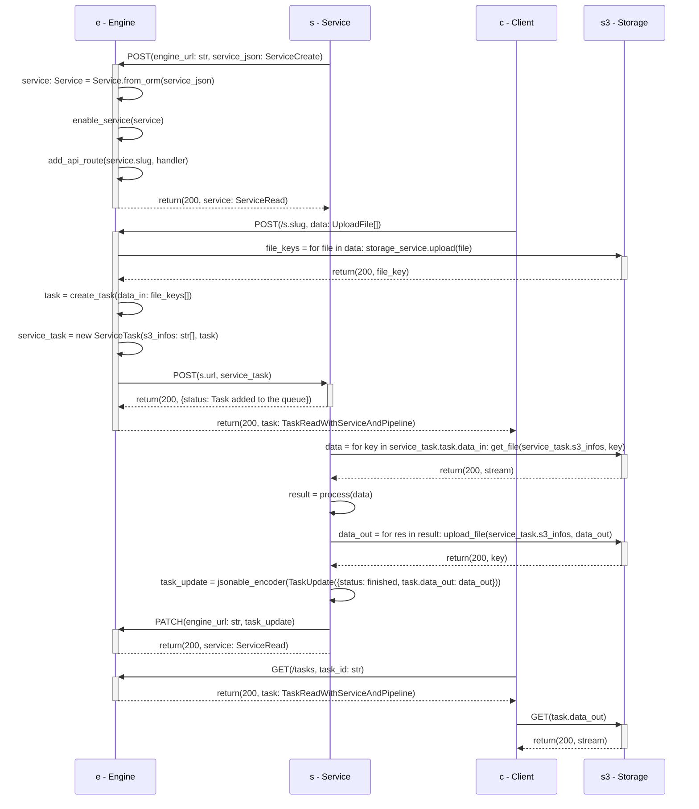

```mermaid
sequenceDiagram
    participant E as e - Engine 
    participant S as s - Service
    participant C as c - Client
    participant S3 as s3 - Storage
    S->>+E: POST(engine_url: str, service_json: ServiceCreate)
    E->>E: service: Service = Service.from_orm(service_json)
    E->>E: enable_service(service)
    E->>E: add_api_route(service.slug, handler)
    E-->>-S: return(200, service: ServiceRead)
    C->>+E: POST(/s.slug, data: UploadFile[])
    E->>+S3: file_keys = for file in data: storage_service.upload(file)
    S3-->>-E: return(200, file_key)
    E->>E: task = create_task(data_in: file_keys[])
    E->>E: service_task = new ServiceTask(s3_infos: str[], task)
    E->>+S: POST(s.url, service_task)
    S-->>-E: return(200, {status: Task added to the queue})
    E-->>-C: return(200, task: TaskReadWithServiceAndPipeline)
    S->>+S3: data = for key in service_task.task.data_in: get_file(service_task.s3_infos, key)
    S3-->>-S: return(200, stream)
    S->>S: result = process(data)
    S->>+S3: data_out = for res in result: upload_file(service_task.s3_infos, data_out)
    S3-->>-S: return(200, key)
    S->>S: task_update = jsonable_encoder(TaskUpdate({status: finished, task.data_out: data_out}))
    S->>+E: PATCH(engine_url: str, task_update)
    E-->-S: return(200, service: ServiceRead)
    C->>+E: GET(/tasks, task_id: str)
    E-->>-C: return(200, task: TaskReadWithServiceAndPipeline)
    C->>+S3: GET(task.data_out)
    S3-->>-C: return(200, stream)
```