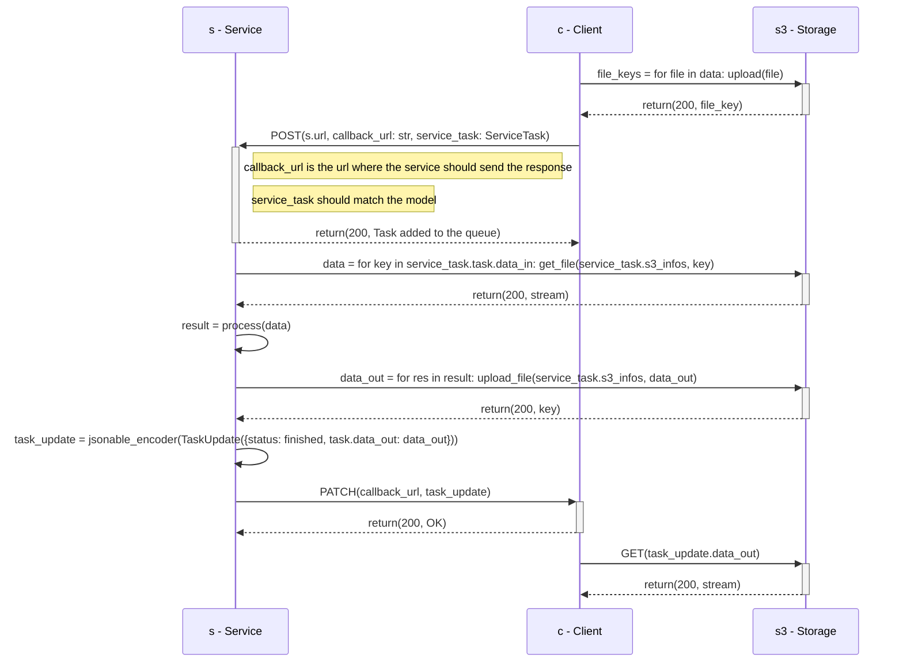

```mermaid
sequenceDiagram
    participant S as s - Service
    participant C as c - Client
    participant S3 as s3 - Storage
    C->>+S3: file_keys = for file in data: upload(file)
    S3-->>-C: return(200, file_key)
    C->>+S: POST(s.url, callback_url: str, service_task: ServiceTask)
    Note right of S: callback_url is the url where the service should send the response
    Note right of S: service_task should match the model
    S-->>-C: return(200, Task added to the queue)
    S->>+S3: data = for key in service_task.task.data_in: get_file(service_task.s3_infos, key)
    S3-->>-S: return(200, stream)
    S->>S: result = process(data)
    S->>+S3: data_out = for res in result: upload_file(service_task.s3_infos, data_out)
    S3-->>-S: return(200, key)
    S->>S: task_update = jsonable_encoder(TaskUpdate({status: finished, task.data_out: data_out}))
    S->>+C: PATCH(callback_url, task_update)
    C-->>-S: return(200, OK)
    C->>+S3: GET(task_update.data_out)
    S3-->>-C: return(200, stream)
```