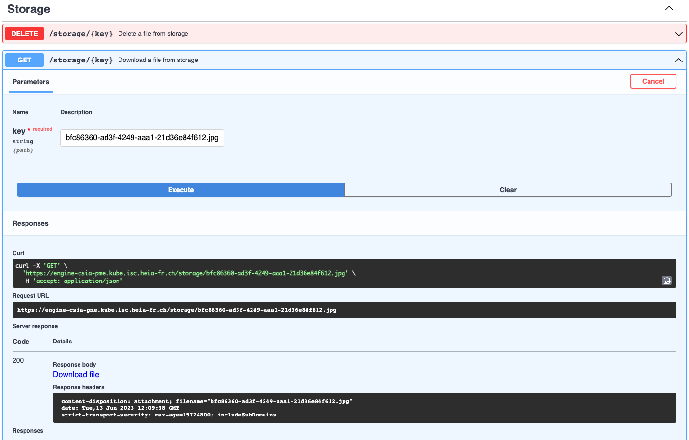
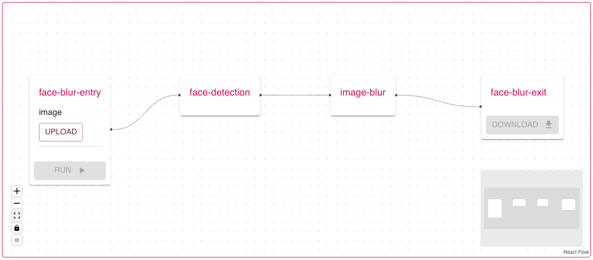
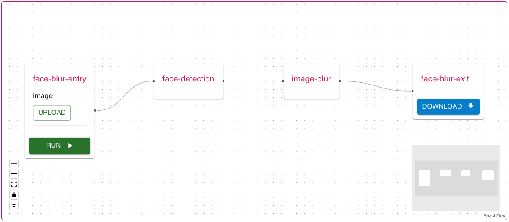

# Implement a pipeline

This tutorial shows how to implement a [Pipeline](../reference/pipeline.md) in the Swiss AI Center project step by step.
It will guide you through the process of creating a [Pipeline](../reference/pipeline.md) to detect faces in an image and blur them.

## Tutorial

### Prerequisites

To follow this tutorial, you need to have the following tools installed:

- [Python 3.10](https://www.python.org/downloads/)
- An IDE (e.g. [Visual Studio Code](https://code.visualstudio.com/))

### Prepare the Core Engine

To implement a [Pipeline](../reference/pipeline.md), you need to have a running [Core Engine](../reference/core-engine.md). If you don't have one, you can follow the [Core Engine](../reference/core-engine.md) documentation.

!!! optional "Run the Webapp"
    For a better experience you can run the webapp by following the [webapp reference](../reference/webapp.md) documentation.

### Prepare the services

The first step is to prepare the services that will be used in the [Pipeline](../reference/pipeline.md). In this tutorial, we will use the following services:

- [Face detection](https://face-detection-swiss-ai-center.kube.isc.heia-fr.ch/docs)
- [Image blur](https://image-blur-swiss-ai-center.kube.isc.heia-fr.ch/docs)

#### Launch the services

If the services are not running you can follow the explanations in the reference documentation to start them.

- [Face detection](../reference/face-detection.md)
- [Image blur](../reference/image-blur.md)

### Create the pipeline

The [Pipeline](../reference/pipeline.md) is created by posting a JSON object to the `/pipelines` endpoint of the [Core Engine](../reference/core-engine.md). Create a file named `face-blur-pipeline.json` in your IDE with the following code:

``` json hl_lines="29 36"
{
    "name": "Face Blur",
    "slug": "face-blur",
    "summary": "Face Blur",
    "description": "Face Blur",
    "data_in_fields": [
        {
            "name": "image",
            "type": [
                "image/jpeg",
                "image/png"
            ]
        }
    ],
    "data_out_fields": [
        {
            "name": "result",
            "type": [
                "image/jpeg",
                "image/png"
            ]
        }
    ],
    "steps": [
        {
            "identifier": "face-detection",
            "needs": [],
            "inputs": ["pipeline.image"],
            "service_slug": "face-detection" // change this with the slug of your face detection service
        },
        {
            "identifier": "image-blur",
            "needs": ["face-detection"],
            "condition": "len(face-detection.result['areas']) > 0",
            "inputs": ["pipeline.image", "face-detection.result"],
            "service_slug": "image-blur" // change this with the slug of your image blur service
        }
    ]
}
```

!!! note
    You can find the slug of your services by going to the FastAPI documentation of the running [Core Engine](../reference/core-engine.md) and use the `/services` endpoint.
    You will find the slug of your services in the response.
    <!-- markdownlint-disable MD046 MD038 -->
    ``` json hl_lines="6 12"
        [
            {
                "created_at": "2023-06-01T13:55:15.936033",
                "updated_at": "2023-06-01T13:55:19.831817",
                "name": "Face Detection",
                "slug": "face-detection",
            },
            {
                "created_at": "2023-06-01T13:55:15.936033",
                "updated_at": "2023-06-01T13:55:19.800560",
                "name": "Image Blur",
                "slug": "image-blur",
            }
        ]
    ```
    <!-- markdownlint-enable MD046 MD038 -->

What we just did is to create a [Pipeline](../reference/pipeline.md) with two steps. The first step is the face detection service and the second step is the image blur service. The second step will only be executed if the first step detects at least one face. The [Pipeline](../reference/pipeline.md) will take an image as input and return an image as output.

The inputs of each step are the outputs of the previous steps. The first step takes the pipeline's image as input and the second step takes the [Pipeline](../reference/pipeline.md)'s image and the result of the face detection as input.

!!! note
    The `identifier` field of each step is the name of the step in the [Pipeline](../reference/pipeline.md). It is used to reference the step in the `needs` and `inputs` fields.

### Post the pipeline

Now that we have our [Pipeline](../reference/pipeline.md), we can post it to the [Core Engine](../reference/core-engine.md). To do so, go to the FastAPI documentation of the running [Core Engine](../reference/core-engine.md) and use the `/pipelines` endpoint to post the [Pipeline](../reference/pipeline.md) by clicking on the `Try it out` button

Simply copy the content of the `face-blur-pipeline.json` file and paste it in the `body` field of the `/pipelines` endpoint and click on the `Execute` button.


You should receive a `200` response with the [Pipeline](../reference/pipeline.md)ine you just posted.

### Run the pipeline

You can run the pipeline using the FastAPI Swagger interface or by using the [Webapp](../reference/webapp.md).

#### Using the FastAPI Swagger interface

Now that we have our [Pipeline](../reference/pipeline.md), we can run it. To do so, go to the FastAPI documentation of the running [Core Engine](../reference/core-engine.md) and you should see the [Pipeline](../reference/pipeline.md) you just posted in the `Registered pipelines` endpoint with the slug `/face-blur`.


Click on the `Try it out` button, add an image to the body and click on the `Execute` button.


You should receive a `200` response with a `Pipeline Execution` object in the response body. This object contains the id of the execution and the tasks that will be executed.

``` json hl_lines="5-24"
{
  "pipeline_id": "2175ae79-4e48-4d1b-97df-0bcbba4c5d2b",
  "current_pipeline_step_id": "e0028cf9-0b62-48b4-b0c7-b91ec930d083",
  ...
  "tasks": [
    {
      "data_in": [
        "e930424b-63a8-4a4e-b49c-54eb50cd1996.jpg"
      ],
      "data_out": null,
      "status": "pending",
      "service_id": "35ace881-6673-4fb6-b454-2f94b1547fd6",
      "pipeline_execution_id": "a17dd3ef-0682-4154-baaa-cb524650f6f4",
      "id": "01636a67-b78e-41a6-9127-9efa1f0c1a9a"
    },
    {
      "data_in": null,
      "data_out": null,
      "status": "scheduled",
      "service_id": "6a20b1b7-ef3d-4a01-bf05-409558bda916",
      "pipeline_execution_id": "a17dd3ef-0682-4154-baaa-cb524650f6f4",
      "id": "9557c201-477f-45c6-8b8a-93ce93079f74"
    }    
  ]
}
```

You can check the status of the execution by checking the status of the last task with the `/tasks/{task_id}` endpoint. You can find the id of the last task in the `tasks` array of the [Pipeline](../reference/pipeline.md) execution object.

``` json hl_lines="9 14"
 {
  "created_at": "2023-06-06T14:45:25.517644",
  "updated_at": "2023-06-13T11:50:10.151580",
  "data_in": [
    "e930424b-63a8-4a4e-b49c-54eb50cd1996.jpg",
    "2594162e-7927-4dc9-9a22-d135154f9e93.json"
  ],
  "data_out": [
    "bfc86360-ad3f-4249-aaa1-21d36e84f612.jpg"
  ],
  "status": "finished",
  "service_id": "6a20b1b7-ef3d-4a01-bf05-409558bda916",
  "pipeline_execution_id": "a17dd3ef-0682-4154-baaa-cb524650f6f4",
  "id": "9557c201-477f-45c6-8b8a-93ce93079f74",
  ...
  "pipeline_execution": {
    "created_at": "2023-06-06T14:45:25.517644",
    "updated_at": "2023-06-13T11:50:10.156728",
    "pipeline_id": "2175ae79-4e48-4d1b-97df-0bcbba4c5d2b",
    "current_pipeline_step_id": null,
    "id": "a17dd3ef-0682-4154-baaa-cb524650f6f4",
    "files": null
  }
}
```

Once the status of the last task is `finished`, you can download the result by copying the data_out file keys and use them with the `/storage/{key}` endpoint.



If the picture you provided had a face, the result should be blurred.

#### Using the Webapp

You can also run the [Pipeline](../reference/pipeline.md) using the [Webapp](../reference/webapp.md). To do so, go to the Webapp in your browser and find the [Pipeline](../reference/pipeline.md) you just posted in the `Pipelines` section.


Click on the `VIEW` button and you should see the [Pipeline](../reference/pipeline.md) as a Flow.



Click on the `UPLOAD` button and upload an image. Now you can click on the `RUN` button and the [Pipeline](../reference/pipeline.md) will be executed. When the [Pipeline](../reference/pipeline.md) is finished, you can download the result by clicking on the `DOWNLOAD` button that will be enabled.



If the picture you provided had a face, the result should be blurred.

!!! success "Congratulations!"
    You have successfully created a [Pipeline](../reference/pipeline.md) locally. Now, you can use the same process to create a [Pipeline](../reference/pipeline.md) on the [Core Engine](../reference/core-engine.md) deployed on the cloud.
