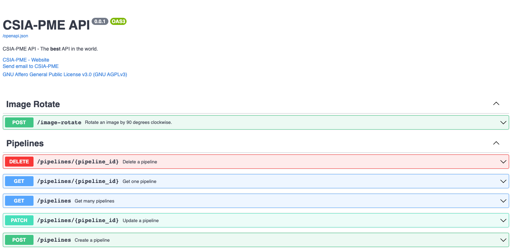

# Implement a service

This tutorial shows how to implement a service in the CSIA-PME project step by step.
It will guide you through the process of creating a service with or without a model.

!!! Info
    Note that a service can be implemented in any programming language as long as it follows the [specifications](/csia-pme/reference/service/#specifications) of the CSIA-PME project. This tutorial is using Python 3.10.

## Tutorial

### Prerequisites

To follow this tutorial, you need to have the following tools installed:

- [Python 3.10](https://www.python.org/downloads/)

### 1. Service without a model

#### 1.1 Get the source code

First, you can download or clone the source code from the [CSIA-PME service templates repository](https://github.com/csia-pme/services-templates).

In this tutorial, we will implement a service that does not require a model, so we will use the `sample-service-without-model` template.

Open your terminal and copy the content of the template to a new folder called `image-rotate`. Then go inside it.

```bash
mkdir image-rotate
cp -r sample-service-without-model/* image-rotate
cd image-rotate
```

#### 1.2 Create a virtual environment

Instead of installing the dependencies globally, it is recommended to create a virtual environment.

To create a virtual environment, run the following command inside the project folder:

```sh
python3.10 -m venv .venv
```

Then, activate the virtual environment:

```sh
source .venv/bin/activate
```

#### 1.3 Install the dependencies

For the service to work we will need to install numpy and opencv-python in addition to the dependencies of the template.
So edit the `requirements.txt` file and add the following lines:

```txt hl_lines="2 3"
common-code[test] @ git+https://github.com/csia-pme/csia-pme.git@main#subdirectory=common-code
numpy==1.24.1
opencv-python==4.7.0.72
```

Then, install the dependencies:

```sh
pip install -r requirements.txt
```
This will install the default service dependencies and the ones we just added.

#### 1.4 Implement the service

##### 1.4.1 Update the README

Open the `README.md` file and update the title and the description of the service.

```md
# Image Rotate

This service rotates an image by 90, 180 or 270 degrees clockwise.
```

##### 1.4.2 Update the service kubernetes configuration

In the `kubernetes` folder, you will find the configuration files for the service.

Rename all the files by replacing `sample-service` with `image-rotate`.

```
image-rotate
├── kubernetes
│   ├── image-rotate.config-map.yaml
│   ├── image-rotate.ingress.yaml
│   ├── image-rotate.service.yaml
│   └── image-rotate.stateful.yaml
└── ...
```

Open the `image-rotate.config-map.yaml` file and update `sample-service` with `image-rotate`.

```yaml hl_lines="5 8 15"
apiVersion: v1
kind: ConfigMap
metadata:
  # TODO: 1. CHANGE THE NAME OF THE CONFIG MAP (1)!
  name: image-rotate-config
  labels:
    # TODO: 2. CHANGE THE APP LABEL (2)!
    app: image-rotate
data:
  ENVIRONMENT: development
  LOG_LEVEL: debug
  ENGINE_URL: http://engine-service:8080
  # TODO: 3. CHANGE THE SERVICE URL (3)!
  # (the port must be the same as in the sample-service.service.yml and unused by other services)
  SERVICE_URL: http://image-rotate-service:8001
```

1. Change the name of the config map to `image-rotate-config`
2. Change the app label to `image-rotate`
3. Change the service url to `http://image-rotate-service:8001`. The port must be the same as in the `image-rotate.service.yaml` and unused by other services. (this is for local development only)

Open the `image-rotate.ingress.yaml` file and update `sample-service` with `image-rotate`.

```yaml hl_lines="5 12 20 26"
apiVersion: networking.k8s.io/v1
kind: Ingress
metadata:
  # TODO: 1. CHANGE THE NAME OF THE INGRESS (1)!
  name: image-rotate-ingress
  annotations:
    nginx.ingress.kubernetes.io/proxy-body-size: "16m"
    nginx.org/client-max-body-size: "16m"
spec:
  rules:
  # TODO: 2. CHANGE THE HOST (2)!
  - host: image-rotate-csia-pme.kube.isc.heia-fr.ch
    http:
      paths:
      - path: /
        pathType: Prefix
        backend:
          service:
            # TODO: 3. CHANGE THE NAME OF THE SERVICE (3)!
            name: image-rotate-service
            port:
              number: 80
  tls:
    - hosts:
        # TODO: 4. CHANGE THE HOST (4)!
        - image-rotate-csia-pme.kube.isc.heia-fr.ch
```

1. Change the name of the ingress to `image-rotate-ingress`
2. Change the host to `image-rotate-csia-pme.kube.isc.heia-fr.ch`
3. Change the name of the service to `image-rotate-service`
4. Change the host to `image-rotate-csia-pme.kube.isc.heia-fr.ch`

!!! info "Note"
    The host can be changed to your own domain name if the service is deployed on another Kubernetes cluster.

Open the `image-rotate.service.yaml` file and update `sample-service` with `image-rotate`.

```yaml hl_lines="5 11 16"
apiVersion: v1
kind: Service
metadata:
  # TODO: 1. CHANGE THE NAME OF THE SERVICE (1)!
  name: image-rotate-service
spec:
  type: LoadBalancer
  ports:
    - name: http
      # TODO: 2. CHANGE THE PORT (must be the same as in the sample-service.config-map.yml) (2)!
      port: 8001
      targetPort: 80
      protocol: TCP
  selector:
    # TODO: 3. CHANGE THE APP LABEL (3)!
    app: image-rotate
```

1. Change the name of the service to `image-rotate-service`
2. Change the port to `8001`. The port must be the same as in the `image-rotate.config-map.yaml` and unused by other services. (this is for local development only)
3. Change the app label to `image-rotate`

Open the `image-rotate.stateful.yaml` file and update `sample-service` with `image-rotate`.

```yaml hl_lines="6 9 12 17 22 26 28 44"
apiVersion: apps/v1
kind: StatefulSet
metadata:
  # This name uniquely identifies the stateful set
  # TODO: 1. CHANGE THE NAME OF THE STATEFUL SET (1)!
  name: sample-service-stateful
  labels:
    # TODO: 2. CHANGE THE APP LABEL (2)!
    app: sample-service
spec:
  # TODO: 3. CHANGE THE NAME OF THE SERVICE (3)!
  serviceName: sample-service
  replicas: 1
  selector:
    matchLabels:
      # TODO: 4. CHANGE THE APP LABEL (4)!
      app: sample-service
  template:
    metadata:
      labels:
        # TODO: 5. CHANGE THE APP LABEL (5)!
        app: sample-service
    spec:
      containers:
      # TODO: 6. CHANGE THE NAME OF THE CONTAINER (6)!
      - name: sample-service
        # TODO: 7. CHANGE THE IMAGE NAME (7)!
        image: ghcr.io/csia-pme/csia-pme-sample-service:latest
        # If you build the image locally, change the next line to `imagePullPolicy: Never` - there is no need to pull the image
        imagePullPolicy: Always
        ports:
        - name: http
          containerPort: 80
        env:
        - name: MAX_TASKS
          value: "50"
        - name: ENGINE_ANNOUNCE_RETRIES
          value: "5"
        - name: ENGINE_ANNOUNCE_RETRY_DELAY
          value: "3"
        envFrom:
          - configMapRef:
              # TODO: 8. CHANGE THE NAME OF THE CONFIG MAP (8)!
              name: sample-service-config
```

1. Change the name of the stateful set to `image-rotate-stateful`
2. Change the app label to `image-rotate`
3. Change the name of the service to `image-rotate`
4. Change the app label to `image-rotate`
5. Change the app label to `image-rotate`
6. Change the name of the container to `image-rotate`
7. Change the image name to `ghcr.io/csia-pme/csia-pme-image-rotate-service:latest`
8. Change the name of the config map to `image-rotate-config`

!!! warning "TODOs"
    When you are done, you need to remove all the TODOs from the files.

##### 1.4.3 Update the service code

First open the `.env` file and update the `SERVICE_URL` variable to `http://localhost:8001`. The port must be the same as in the `image-rotate.config-map.yaml` file.

```bash hl_lines="12"
# Log level
LOG_LEVEL=debug

# Environment
ENVIRONMENT=development

# The Engine URL
ENGINE_URL="http://localhost:8080"

# The Service URL
# TODO: 1. REPLACE THE PORT WITH THE SAME AS IN THE CONFIG-MAP FILE (1)!
SERVICE_URL="http://localhost:8001"

# The maximum of tasks the service can process
MAX_TASKS=50

# The number of times the service tries to announce itself to the Engine
ENGINE_ANNOUNCE_RETRIES=5

# The number of seconds between each retry
ENGINE_ANNOUNCE_RETRY_DELAY=3
```

1. Replace the port with the same as in the `image-rotate.config-map.yaml` file.

All the code of the service is in the `main.py` file.
The service is a simple image rotation service that rotates the image by 90, 180, 270 degrees clockwise depending on the value of the `rotation` parameter.

Open the `main.py` with your favorite editor and follow the instructions below.

```py hl_lines="20-22 29-31 39-40 46-52 56-83 87-92 97-112"
import asyncio
import time
from fastapi import FastAPI
from fastapi.middleware.cors import CORSMiddleware
from fastapi.responses import RedirectResponse
from common_code.config import get_settings
from pydantic import Field
from common_code.http_client import HttpClient
from common_code.logger.logger import get_logger
from common_code.service.controller import router as service_router
from common_code.service.service import ServiceService
from common_code.storage.service import StorageService
from common_code.tasks.controller import router as tasks_router
from common_code.tasks.service import TasksService
from common_code.service.models import Service, FieldDescription
from common_code.service.enums import ServiceStatus, FieldDescriptionType

# Imports required by the service's model
# TODO: 1. ADD REQUIRED IMPORTS (ALSO IN THE REQUIREMENTS.TXT) (1)!
import cv2
import numpy as np
from common_code.tasks.service import get_extension

settings = get_settings()


class MyService(Service):
    # TODO: 2. CHANGE THIS DESCRIPTION (2)!
    """
    Image rotate model
    """

    # Any additional fields must be excluded for Pydantic to work
    model: object = Field(exclude=True)

    def __init__(self):
        super().__init__(
            # TODO: 3. CHANGE THE SERVICE NAME AND SLUG (3)!
            name="Image Rotate",
            slug="image-rotate",
            url=settings.service_url,
            summary=api_summary,
            description=api_description,
            status=ServiceStatus.AVAILABLE,
            # TODO: 4. CHANGE THE INPUT AND OUTPUT FIELDS (4)!
            data_in_fields=[
                FieldDescription(name="image", type=[FieldDescriptionType.IMAGE_PNG, FieldDescriptionType.IMAGE_JPEG]),
                FieldDescription(name="rotation", type=[FieldDescriptionType.TEXT_PLAIN]),
            ],
            data_out_fields=[
                FieldDescription(name="result", type=[FieldDescriptionType.IMAGE_PNG, FieldDescriptionType.IMAGE_JPEG]),
            ]
        )

    # TODO: 5. CHANGE THE PROCESS METHOD (CORE OF THE SERVICE) (5)!
    async def process(self, data):
        # NOTE that the data is a dictionary with the keys being the field names set in the data_in_fields
        raw = data["image"].data
        input_type = data["image"].type
        rotation = data["rotation"].data

        if len(rotation) == 0:
            rotation = 90
        else:
            rotation = int(rotation)

        # Decode the image
        img = cv2.imdecode(np.frombuffer(raw, np.uint8), 1)

        # Rotate the image
        for i in range(int(rotation / 90)):
            img = cv2.rotate(img, cv2.ROTATE_90_CLOCKWISE)
        # Encode the image with the same format as the input
        guessed_extension = get_extension(input_type)
        is_success, out_buff = cv2.imencode(guessed_extension, img)

        # NOTE that the result must be a dictionary with the keys being the field names set in the data_out_fields
        return {
            "result": TaskData(
                data=out_buff.tobytes(),
                type=input_type,
            )
        }


# TODO: 6. CHANGE THE API DESCRIPTION AND SUMMARY (6)!
api_description = """
Rotate an image by 90 degrees clockwise depending on the value of the `rotation` parameter. (90, 180, 270)
"""
api_summary = """
Rotate an image by 90 degrees clockwise.
"""

# Define the FastAPI application with information
# TODO: 7. CHANGE THE API TITLE, VERSION, CONTACT AND LICENSE (7)!
app = FastAPI(
    title="Image Rotate API.",
    description=api_description,
    version="0.0.1",
    contact={
        "name": "CSIA-PME",
        "url": "https://swiss-ai-center.ch/",
        "email": "info@swiss-ai-center.ch",
    },
    swagger_ui_parameters={
        "tagsSorter": "alpha",
        "operationsSorter": "method",
    },
    license_info={
        "name": "GNU Affero General Public License v3.0 (GNU AGPLv3)",
        "url": "https://choosealicense.com/licenses/agpl-3.0/",
    },
)
...
```

1. Import the OpenCV library and the get_extension function from the tasks service. This function is used to guess the extension of the image based on the input type.
2. Change the description of the service.
3. Change the name and the slug of the service. This is used to identify the service in the engine.
4. Change the input/output fields of the service. The name of the field is the key of the dictionary that will be used in the process function. The type of the field is the type of the data that will be sent to the service. They are defined in the FieldDescriptionType enum.
5. Change the process function. This is the core of the service. The data is a dictionary with the keys being the field names set in the data_in_fields. The result must be a dictionary with the keys being the field names set in the data_out_fields.
6. Change the API description and summary.
7. Change the API title, version, contact and license.


##### 1.4.4 Dockerfile

The Dockerfile is used to build the Docker image of the service. We need to add some packages in order to use the OpenCV library.

```dockerfile hl_lines="6"
# Base image
FROM python:3.10

# Install all required packages to run the model
# TODO: 1. Add any additional packages required to run your model (1)!
RUN apt update && apt install --yes ffmpeg libsm6 libxext6
...
```

1. Add ffmpeg, libsm6 and libxext6 to the list of packages to install.

#### 1.5 Create the Workflow for GitHub Actions

First, if you don't have the file already, download the `sample-service-without-model.yml` file from the [GitHub repository](https://github.com/csia-pme/services-templates/workflows) and rename it to `image-rotate.yml` in the `.github/workflows` folder.

Open it with your IDE and modify the `sample-service` texts with `image-rotate`

```yaml hl_lines="3-4 9 19 21 37 43 54 56 63 69 71 75-78 81 89 91-96"
# Documentation: https://docs.github.com/en/actions/using-workflows/workflow-syntax-for-github-actions#jobsjob_idstepsuses
# TODO: 1. CHANGE THE NAME AND THE RUN NAME (1)!
name: image-rotate_workflow
run-name: image-rotate workflow

# Allow one concurrent deployment
concurrency:
  # TODO: 2. CHANGE THE GROUP NAME (2)!
  group: "image-rotate"
  cancel-in-progress: true

on:
  push:
    paths:
      - .github/actions/build-and-push-docker-image-to-github/action.yml
      - .github/actions/execute-command-on-kubernetes-cluster/action.yml
      - .github/actions/test-python-app/action.yml
      # TODO: 3. CHANGE THE WORKFLOW NAME (3)!
      - .github/workflows/image-rotate.yml
      # TODO: 4. CHANGE THE PATH TO THE PYTHON APP (4)!
      - services/image-rotate/**/*

  # Allows you to run this workflow manually from the Actions tab
  workflow_dispatch:

jobs:
  run-workflow:
    runs-on: ubuntu-latest
    steps:
      - name: Clone repository
        uses: actions/checkout@v3

      - name: Lint Python app
        uses: ./.github/actions/lint-python-app
        with:
          # TODO: 5. CHANGE THE PATH TO THE PYTHON APP (5)!
          python-app-path: ./services/image-rotate

      - name: Test Python app
        uses: ./.github/actions/test-python-app
        with:
          # TODO: 6. CHANGE THE PATH TO THE PYTHON APP (6)!
          python-app-path: ./services/image-rotate

      - name: Build and push Docker image to GitHub
        id: build-and-push-docker-image-to-github
        # Only run on main
        if: github.ref == 'refs/heads/main'
        uses: ./.github/actions/build-and-push-docker-image-to-github
        with:
          docker-registry-username: ${{ github.actor }}
          docker-registry-password: ${{ secrets.GITHUB_TOKEN }}
          # TODO: 7. CHANGE THE DOCKER IMAGE NAME (7)!
          docker-image-name: ${{ github.repository }}-image-rotate
          # TODO: 8. CHANGE THE PATH TO THE DOCKER IMAGE CONTEXT (8)!
          docker-image-context: ./services/image-rotate

      - name: Prepare configuration files with secrets from GitHub Secrets
        # Only run on main
        if: github.ref == 'refs/heads/main'
        shell: bash
        # TODO: 9. CHANGE THE PATH TO THE KUBERNETES CONFIGURATION FILES (9)!
        working-directory: services/image-rotate/kubernetes
        env:
          ENVIRONMENT: production
          LOG_LEVEL: info
          ENGINE_URL: https://engine-csia-pme.kube.isc.heia-fr.ch
          # TODO: 10. CHANGE THE URL OF THE SAMPLE SERVICE (10)!
          SERVICE_URL: https://image-rotate-csia-pme.kube.isc.heia-fr.ch
        # TODO: 11. CHANGE THE NAME OF THE CONFIGURATION FILES (11)!
        run: |
          # Set image-rotate version
          docker_image_tags=(${{ steps.build-and-push-docker-image-to-github.outputs.docker-image-tags }})
          docker_image_sha_tag="${docker_image_tags[1]}"
          yq ".spec.template.spec.containers[0].image = \"$docker_image_sha_tag\"" image-rotate.stateful.yml > new-image-rotate.stateful.yml && mv new-image-rotate.stateful.yml image-rotate.stateful.yml

          # Set image-rotate configuration
          yq '.data = (.data | to_entries | map({"key": .key, "value": "${" + .key + "}"}) | from_entries)' image-rotate.config-map.yml | envsubst > new-image-rotate.config-map.yml && mv new-image-rotate.config-map.yml image-rotate.config-map.yml

      # TODO: 12. CHANGE THE NAME OF THE ACTION (12)!
      - name: Deploy image-rotate on the Kubernetes cluster
        # Only run on main
        if: github.ref == 'refs/heads/main'
        uses: ./.github/actions/execute-command-on-kubernetes-cluster
        with:
          kube-config: ${{ secrets.KUBE_CONFIG }}
          kube-namespace: csia-pme-prod
          # TODO: 13. CHANGE THE KUBERNETES CONTEXT (13)!
          kubectl-context: ./services/image-rotate/kubernetes
          # TODO: 14. CHANGE THE PATH TO THE KUBERNETES CONFIGURATION FILES (14)!
          kubectl-args: |
            apply \
              -f image-rotate.config-map.yml \
              -f image-rotate.stateful.yml \
              -f image-rotate.service.yml \
              -f image-rotate.ingress.yml
```

1. Change the name and the run name of the workflow.
2. Change the group name.
3. Change the workflow name.
4. Change the path to the Python app.
5. Change the path to the Python app.
6. Change the path to the Python app.
7. Change the Docker image name.
8. Change the path to the Docker image context.
9. Change the path to the Kubernetes configuration files.
10. Change the URL of the sample service.
11. Change the name of the configuration files.
12. Change the name of the action.
13. Change the Kubernetes context.
14. Change the path to the Kubernetes configuration files.


!!! info "Note"
    The host can be changed to your own domain name if the service is deployed on another Kubernetes cluster.

#### 1.6 Test the service

Now that the service is ready, we can test it.

Open a terminal, navigate to the `image-rotate/src` and run the following command:

```bash
pytest --cov-report term:skip-covered --cov-report term-missing --cov=. -s --cov-config=.coveragerc
```

All the tests should pass.

```bash
======================== test session starts =========================
--------- coverage: platform darwin, python 3.10.10-final-0 ----------
Name                        Stmts   Miss  Cover   Missing
---------------------------------------------------------
src/main.py                    70     11    84%   53-70
src/tests/test_service.py      83     12    86%   13-18, 24-30, 114-115
---------------------------------------------------------
TOTAL                         188     23    88%

4 files skipped due to complete coverage.


========================= 5 passed in 29.12s =========================
```

In order to test the service, you need to have a running engine. To do so, follow the instructions in the [Engine](/csia-pme/reference/engine/#start-the-service-locally-with-minikube-and-the-docker-image-hosted-on-github) reference.

Once the engine is running, you can start the service by running the following command:

```bash
uvicorn main:app --reload --host localhost --port 8001 # (1)!
```

1. The port must be the same as the one defined in the `.env` file and different from the one used by the engine.

The output should be similar to the following:

```bash
INFO:     Will watch for changes in these directories: ['/Users/andrea/Git/iCoSys/csia-pme/services/image-rotate/src']
INFO:     Uvicorn running on http://localhost:9393 (Press CTRL+C to quit)
INFO:     Started reloader process [22602] using StatReload
INFO:     Started server process [22604]
INFO:     Waiting for application startup.
INFO:     [2023-03-01 11:14:17,950]  [common_code.service.service]: 	Started tasks service
DEBUG:    [2023-03-01 11:14:17,950]  [common_code.service.service]: 	Announcing service: {'name': 'Image Rotate', 'slug': 'image-rotate', 'url': 'http://localhost:9393', 'summary': '\nRotate an image by 90 degrees clockwise.\n', 'description': '\nRotate an image by 90 degrees clockwise depending on the value of the `rotation` parameter. (90, 180, 270)\n', 'status': 'available', 'data_in_fields': [{'name': 'image', 'type': ['image/png', 'image/jpeg']}, {'name': 'rotation', 'type': ['text/plain']}], 'data_out_fields': [{'name': 'result', 'type': ['image/png', 'image/jpeg']}]}
INFO:     [2023-03-01 11:14:17,953]  Application startup complete.
INFO:     [2023-03-01 11:14:18,005]   127.0.0.1:54863 - "GET /status HTTP/1.1" 200 OK
INFO:     [2023-03-01 11:14:18,023]  [common_code.service.service]: 	Successfully announced to the engine
```

Now, you can test the service by sending a request to the engine. To do so, open your browser and navigate to the following URL: `http://localhost:8080/`. You should see the following page:



Now you can test the service by uploading an image and selecting the rotation. Create a file called rotation.txt and add the following content:

```txt
90
```

Now, you can unfold the `/image-rotate` endpoint and click on the Try it out button. Now upload the image and the rotation file and click on the Execute button. The response body should be something similar to the following:

```json hl_lines="12"
{
  "created_at": "2023-03-01T10:59:41",
  "updated_at": null,
  "data_in": [
    "a38ef233-ac01-431d-adc8-cb6269cdeb71.png",
    "a45f42d8-8750-4063-92f0-dd961558c489.txt"
  ],
  "data_out": null,
  "status": "pending",
  "service_id": "bcc6970e-8655-4173-a543-9da1cf2d0477",
  "pipeline_id": null,
  "id": "20422a05-1f14-41b3-bee0-2c365451ce95",
  "service": {
    "created_at": "2023-03-01T10:41:07",
    "updated_at": "2023-03-01T10:59:33",
    "description": "\nRotate an image by 90 degrees clockwise depending on the value of the `rotation` parameter. (90, 180, 270)\n",
    "status": "available",
    "data_in_fields": [
      {
        "name": "image",
        "type": [
          "image/png",
          "image/jpeg"
        ]
      },
      {
        "name": "rotation",
        "type": [
          "text/plain"
        ]
      }
    ],
    "data_out_fields": [
      {
        "name": "result",
        "type": [
          "image/png",
          "image/jpeg"
        ]
      }
    ],
    "id": "bcc6970e-8655-4173-a543-9da1cf2d0477",
    "name": "Image Rotate",
    "slug": "image-rotate",
    "url": "http://localhost:9393",
    "summary": "\nRotate an image by 90 degrees clockwise.\n"
  },
  "pipeline": null
}
```

Now, copy the id of the task and unfold the GET `/tasks/{task_id}` endpoint under the Tasks name.

1. Click on Try it out and paste the id in the task_id field. 
2. Click on Execute.
3. In the body response, find the `data_out` field and copy the id of the image (e.g. `a38ef233-ac01-431d-adc8-cb6269cdeb71.png`).
4. Now, unfold the GET `/storage/{key}` endpoint under the Storage name.
5. Click on Try it out and paste the id of the image in the key field.
6. Click on Execute.
7. Click on the Download file button and save the image in your computer.

The image should be rotated by 90 degrees.

!!! success "Congratulations!"
    You have successfully created a service and tested it locally. Now, you can push the service to GitHub and deploy it on the engine using the workflow created in the previous section.
